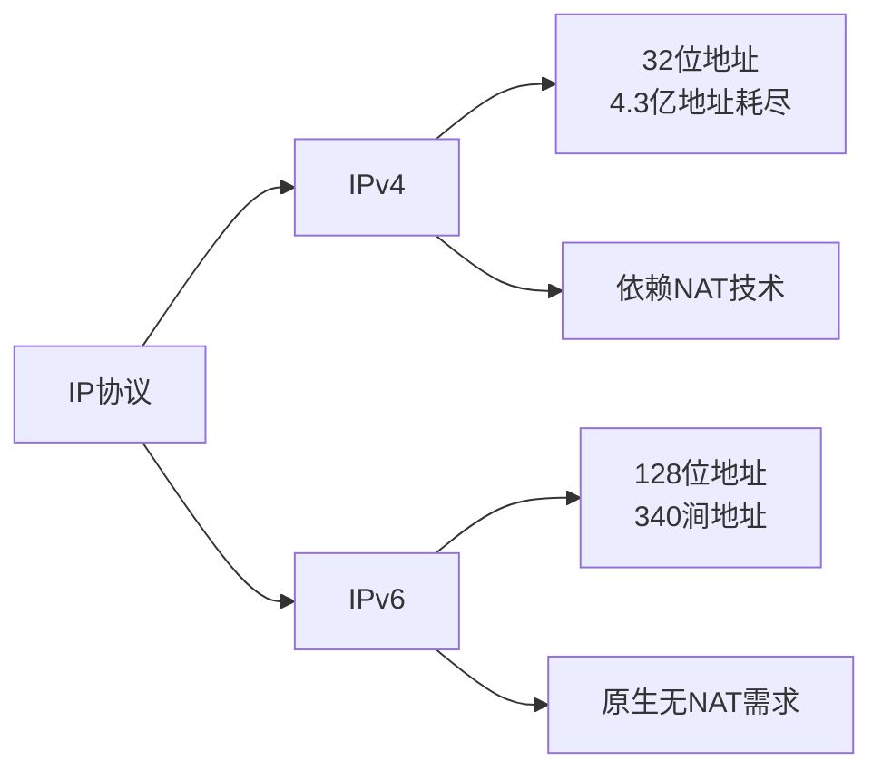
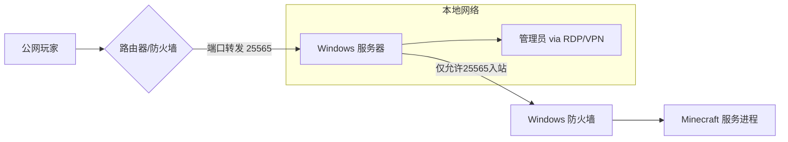
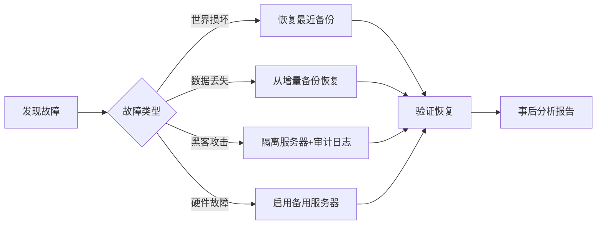

# Minecraft 1.19.4 Fabric 开服指南

---

## 目录
1. [基础准备](#基础准备)
2. [服务端启动](#服务端启动)
3. [网络问题深度解析](#网络问题深度解析)
4. [防火墙设置](#防火墙设置)
5. [server.properties详解](#serverproperties详解)
6. [Minecraft 1.19.4 服务端管理注意事项指南](#Minecraft 1.19.4 服务端管理注意事项指南)
7. [网络诊断](#网络诊断)

---

# 基础准备

- 运行服务端需要一些基础准备工作，如jdk17或更高版本

以下是jdk的下载网址[Oracle-jdk](https://www.oracle.com/java/technologies/downloads/#jdk24-windows)

安装完成后可输入以下指令验证是否安装完成

```bash
#此指令可显示你已安装的Java版本
java -version
```

---

# 服务端启动

- 确认准备完全后，即可启动服务端

  请先将fabric服务端文件移至一个单独的文件夹，以下是fabric服务端文件下载地址[fabric-server](https://fabricmc.net/use/server/) **请注意版本对应!**

上述步骤完成后请在服务端文件所在文件夹的上方文件地址栏输入cmd以确保指令运行环境处在当前文件夹内，然后输入以下指令启动服务端

```bash
#此处假设服务端文件名为（fabric-server-mc.1.21.5-loader.0.16.14-launcher.1.0.3.jar），请根据实际情况做适当调整修改
java -jar fabric-server-mc.1.21.5-loader.0.16.14-launcher.1.0.3.jar
```

之后服务端将会启动，并展开文件

---

# 网络问题深度解析

---

## **Minecraft Fabric服务器网络连通性技术文档**
---

## **一、核心网络问题解析**
### **1. 局域网 vs 公网部署**
| **场景**   | **优势**         | **限制**                 | 适用场景                |
| ---------- | ---------------- | ------------------------ | ----------------------- |
| **局域网** | 超低延迟（<1ms） | 仅限同一物理网络设备访问 | 家庭/校园本地联机       |
| **公网**   | 全球可访问       | 依赖公网IP/带宽质量      | 商业服务器/远程好友联机 |

### **2. IPv4与IPv6协议对比**


---

## **二、NAT技术深度解析**
### **1. NAT工作原理（以IPv4为例）**
```plaintext
 局域网设备                NAT路由器              公网
[192.168.1.10:25565]  --> 转换公网IP:端口 --> [玩家访问120.240.35.1:25565]
       ↑                                           |
       |___________ 数据包反向转换 ______________↓
```

### **2. NAT类型与影响**
| **类型**        | 端口映射方式           | 服务器兼容性    |
| --------------- | ---------------------- | --------------- |
| **全锥型NAT**   | 开放所有外部端口       | ★★★★★           |
| **受限锥型NAT** | 仅响应已连接IP         | ★★★☆☆           |
| **对称型NAT**   | 每次连接使用随机新端口 | ★☆☆☆☆（需穿透） |

---

## **三、公网IPv4部署关键问题**
### **1. 私网IP为何公网不可用？**
```plaintext
RFC 1918规定的私有地址范围：
• 10.0.0.0 - 10.255.255.255
• 172.16.0.0 - 172.31.255.255
• 192.168.0.0 - 192.168.255.255

这些地址在公网路由器中会被直接丢弃，导致：
  本地IP 192.168.1.100 → 公网玩家 → 数据包无法路由返回
```

### **2. 公网部署解决方案**
**步骤1：获取真实公网IP**

```bash
# 检测当前IP性质
curl ifconfig.me
# 若返回地址与路由器WAN口地址不一致 → 处于运营商级NAT（CGNAT）
```

**步骤2：端口转发配置（以TP-Link为例）**

```markdown
1. 登录路由器管理页（通常为192.168.0.1）
2. 转发规则 → 虚拟服务器 → 添加新条目：
   - 服务端口：25565
   - 内部IP：服务器本地IP（如192.168.1.100）
   - 协议：TCP/UDP
3. 保存并重启路由器
```

**步骤3：防火墙放行**

- 打开防火墙，开放服务端运行所需端口
- 或完全关闭防火墙（简单但不推荐）


---

## **四、IPv6部署方案**
### **1. 优势与配置要点**
```markdown
• 每个设备拥有**全球唯一公网地址**
• 无需端口转发/NAT
• 配置流程：
  1. 确认运营商支持IPv6（光猫开启IPv4/IPv6双栈）
  2. 路由器启用SLAAC/DHCPv6
  3. 服务器获取2408:8207:xxxx格式地址
```

### **2. 连接方式示例**
```yaml
# server.properties配置
server-ip=::
# 玩家直连地址
[2408:8207:abcd:ef01:1234:5678:9012:3456]:25565
```

---

## **五、连通性测试指南**
### **1. 诊断工具**
| **工具**     | 命令示例               | 检测目标     |
| ------------ | ---------------------- | ------------ |
| `ping`       | `ping server-ip`       | 基础连通性   |
| `telnet`     | `telnet ip 25565`      | 端口开放状态 |
| `traceroute` | `tracert 120.240.35.1` | 路由路径     |
| `nc`(Netcat) | `nc -zv ip 25565`      | 端口握手详情 |

### **2. 常见故障排查**
```markdown
1. **端口阻塞**：
   - 使用 https://portchecker.co 验证25565开放状态
   
2. **Windows防火墙拦截**：
   - 入站规则放行Java(TM) Platform SE binary

3. **运营商限制**：
   - 家庭宽带通常封锁80/443外所有端口 → 需备案开埠
```

---

## **六、进阶优化建议**
1. **动态DNS支持**（适用于非固定IP）
   
   ```markdown
   - 使用花生壳/No-IP服务绑定域名
   - 配置路由器DDNS自动更新
   ```
   
3. **IPv4/IPv6双栈部署**
   ```properties
   # fabric服务器启动参数
   java -Djava.net.preferIPv6Addresses=true -jar fabric-server-launch.jar
   ```

---

## **七、内网穿透解决方案**  
### **1. 内网穿透核心原理**
```plaintext
 玩家客户端 → 穿透服务器（公网） → 穿透客户端（本地） → Minecraft服务器
       ↑                                         |
       |___________ 反向隧道连接 __________________↓
```
> **技术本质**：通过第三方公网服务器建立"反向代理隧道"，绕过NAT限制

### **2. 主流穿透方案对比**
| **方案类型**      | 代表工具             | 延迟影响 | 配置复杂度 | 适用场景            |
| ----------------- | -------------------- | -------- | ---------- | ------------------- |
| **TCP/UDP隧道**   | frp / ngrok          | 20-50ms  | 中等       | 常规MC服务器        |
| **P2P穿透**       | ZeroTier / Tailscale | 5-15ms   | 简单       | 好友联机/低延迟需求 |
| **WebSocket隧道** | Cloudflared          | 50-100ms | 复杂       | 严格防火墙环境      |
| **商业托管服务**  | Playit.gg            | 30-80ms  | 极简       | 零配置快速部署      |

### **3. 详细配置指南**
#### **方案实例：frp穿透（推荐）**

- **sakurafrp**

  此网站提供了较为简便与廉价的局域网穿透工具，网址→[sakurafrp](https://www.natfrp.com/)

  下方为网站视频教学网址↓

  [都2025年了你还不会使用樱花来我的世界联机？[Minecraft樱花内网穿透（Natfrp）联机教程]](https://www.bilibili.com/video/BV1DdF4eJEBm/?spm_id_from=333.337.search-card.all.click&vd_source=c8d0f1ade16bb6d69206a3cdb0173a57)

**注：上述为网络连通性专业文档，可配合下述视频搭配学习理解**

[基础开服教程](https://www.bilibili.com/video/BV1rq4y117uA/?spm_id_from=333.337.search-card.all.click&vd_source=c8d0f1ade16bb6d69206a3cdb0173a57)

[Windows命令初学者必需知道](https://www.bilibili.com/video/BV1xj411v7Xd/?spm_id_from=333.1387.favlist.content.click&vd_source=c8d0f1ade16bb6d69206a3cdb0173a57)

[子网划分](https://www.bilibili.com/video/BV1HT411U7jV/?spm_id_from=333.1387.favlist.content.click&vd_source=c8d0f1ade16bb6d69206a3cdb0173a57)

[【MC开服】插件、模组我全都要！mohist服务端教学](https://www.bilibili.com/video/BV1pS4y1B73f/?spm_id_from=333.1387.favlist.content.click&vd_source=c8d0f1ade16bb6d69206a3cdb0173a57)

[Windows我的世界开服详细教程](https://www.bilibili.com/video/BV1NQ4y1U7nS/?spm_id_from=333.1387.favlist.content.click&vd_source=c8d0f1ade16bb6d69206a3cdb0173a57)

[【mc开服】教你白嫖运营商公网ipv6跟好兄弟联机](https://www.bilibili.com/video/BV1Lb4y1o7SF/?spm_id_from=333.1387.favlist.content.click&vd_source=c8d0f1ade16bb6d69206a3cdb0173a57)

[什么是NAT？一分钟搞懂网络地址转换的秘密！](https://www.bilibili.com/video/BV19EyVYVEye/?spm_id_from=333.337.search-card.all.click&vd_source=c8d0f1ade16bb6d69206a3cdb0173a57)

- 以下为进阶视频教学

  [小白成神之路，网络知识看这一期足矣！软路由 桥接 端口转发 旁路由 单臂路由 IPv4 IPv6 DDNS](https://www.bilibili.com/video/BV1Gz4y1r791/?spm_id_from=333.337.search-card.all.click&vd_source=c8d0f1ade16bb6d69206a3cdb0173a57)

# 防火墙设置

---

### **Minecraft Java版 Windows 开服防火墙设置指南**  
**核心目标**：允许合法流量进入服务器，阻止非法访问，保障服务器安全。

---

#### **一、必须开放的端口**
1. **主服务端口（TCP）**  
   - **默认端口：`25565`**  
     - 修改位置：`server.properties` 文件中的 `server-port=` 参数。  
   - **防火墙必须允许此端口的入站连接**。  
   - ⚠️ 若修改默认端口（如改为 `25575`），防火墙规则需同步更新。

2. **查询端口（UDP - 可选）**  
   - **默认端口：`25565`**（与主端口相同）  
     - 需在 `server.properties` 中启用 `enable-query=true`。  
   - 仅当客户端需要服务器状态查询时才开放（UDP协议）。

---

#### **二、防火墙设置步骤（以 Windows Defender 防火墙为例）**
##### **方法 1：通过图形界面设置**
1. 打开 **控制面板** > **系统和安全** > **Windows Defender 防火墙** > **高级设置**。  
2. 选择 **入站规则** > **新建规则**。  
3. 规则类型：选择 **端口** → 下一步。  
4. 协议：  
   - 主端口选择 **TCP**，特定端口：`25565`（或自定义端口）。  
   - 若需UDP查询，额外创建一条 **UDP** 规则。  
5. 操作：选择 **允许连接** → 下一步。  
6. 配置文件：勾选 **域、专用、公用**（建议测试时仅勾选“专用”）。  
7. 名称：填写 `Minecraft Server (TCP 25565)` → 完成。

##### **方法 2：通过命令快速开放端口（管理员权限运行CMD）**
```cmd
netsh advfirewall firewall add rule name="Minecraft TCP 25565" dir=in action=allow protocol=TCP localport=25565
netsh advfirewall firewall add rule name="Minecraft UDP 25565" dir=in action=allow protocol=UDP localport=25565
```

---

#### **三、关键安全注意事项**
1. **禁止开放敏感端口**  
   - ❌ 切勿开放 `22 (SSH)`、`3389 (远程桌面/RDP)`、`3306 (MySQL)` 等端口到公网。  
   - ✅ 正确做法：使用 **VPN** 或 **跳板机** 管理服务器，或仅限本地访问。

2. **限制IP访问来源（企业级安全）**  
   - 在防火墙规则中设置 **“作用域”**：  
     - 仅允许特定IP段（如公司网络）访问 `25565` 端口。  
     - 操作：编辑入站规则 > 切换到 **“作用域”** 标签 > 在 **远程IP地址** 中添加允许的IP。  

3. **关闭未使用的端口**  
   - 定期检查入站规则，删除不再需要的规则（如旧测试端口）。

4. **警惕内网穿透工具的风险**  
   - 若使用 **frp/ngrok** 等工具，确保其配置的端口不暴露敏感服务。

5. **验证端口实际开放情况**  
   - 使用 [canyouseeme.org](https://canyouseeme.org) 或 `telnet 你的公网IP 25565` 测试端口是否通畅。

---

#### **四、Windows Server 特别优化**（若系统非Windows Server可忽略）
1. **禁用无关服务**  
   - 关闭 SMB、NetBIOS 等易受攻击的服务：  
     ```cmd
     sc config LanmanServer start= disabled
     sc config LanmanWorkstation start= disabled
     ```
2. **启用日志监控**  
   - 在防火墙规则中启用 **“记录连接”**（属性 > 常规 > 记录事件），定期检查安全日志。

---

#### **五、网络拓扑建议**


---

#### **六、故障排查**
- **问题**：客户端显示“无法连接至服务器”。  
  **解决步骤**：  
  1. 检查 `server.properties` 中的端口是否与防火墙规则一致。  
  2. 运行 `netstat -ano | findstr :25565` 确认服务是否监听。  
  3. 临时关闭防火墙测试是否为规则问题。  

- **问题**：服务器本地可连，外网无法访问。  
  **原因**：路由器未做 **端口转发（Port Forwarding）**，需将路由器的 `25565` 端口指向服务器内网IP。

---

### **总结清单**
| 步骤              | 操作要点                        |
| ----------------- | ------------------------------- |
| 1. 确认服务端口   | 修改 `server.properties`        |
| 2. 开放防火墙入站 | 允许TCP/UDP特定端口             |
| 3. 路由器端口转发 | 映射公网IP:25565 → 服务器内网IP |
| 4. 限制访问范围   | 设置IP白名单（企业级必需）      |
| 5. 关闭无关端口   | 禁用RDP/SMB等公网暴露           |

> **最后建议**：首次开服后，使用 [Shodan](https://www.shodan.io/) 扫描您的公网IP，确认无多余端口暴露。定期更新Java和Windows系统补丁，防止漏洞攻击。
>
> **视频教程→**[1-8shodan搜索技巧](https://www.bilibili.com/video/BV1hV4y1T7Rr/?spm_id_from=333.337.search-card.all.click&vd_source=c8d0f1ade16bb6d69206a3cdb0173a57)

# server.properties详解

---

### **Minecraft 1.19.4 服务端 `server.properties` 文件详解**

---

### **一、文件核心作用**  
`server.properties` 是 **Minecraft 服务端的全局控制中枢**，用于定义服务器的核心运行规则和基础配置。主要作用包括：  

1. **基础参数定义** - 设置服务器端口、名称、玩家容量等基础属性  
2. **游戏规则控制** - 配置游戏模式、难度、PVP、死亡惩罚等核心机制  
3. **世界生成管理** - 控制地形类型、结构生成、世界边界等  
4. **性能优化调节** - 调整视距、模拟距离、网络压缩等关键性能参数  
5. **安全策略配置** - 管理正版验证、白名单、RCON远程控制等安全措施  
6. **功能开关控制** - 启停下界、末地、飞行、命令方块等关键功能  

---

### **二、文件基础信息**  
| 属性         | 说明                                                 |
| ------------ | ---------------------------------------------------- |
| **位置**     | 服务端根目录（与 `server.jar` 同级）                 |
| **生成方式** | 首次启动服务端时自动创建                             |
| **修改生效** | 需重启服务端（部分参数可通过 `/reload` 生效）        |
| **注释符号** | `#` 开头的行视为注释                                 |
| **格式规范** | 每行一个参数，格式为 `参数名=值`（**值不可加引号**） |

---

### **三、参数分类详解**  
#### **1. 基础网络设置**  
| 参数名         | 默认值               | 作用说明                                         |
| -------------- | -------------------- | ------------------------------------------------ |
| `server-port`  | `25565`              | 主服务端口（需在防火墙开放此端口）               |
| `query.port`   | `25565`              | 服务器状态查询端口（与主端口一致）               |
| `motd`         | `A Minecraft Server` | 服务器名称（支持颜色代码 `§` 或 `&`）            |
| `enable-query` | `false`              | 是否开启 GameSpy4 协议查询（服务器状态工具使用） |

#### **2. 世界生成配置**  
| 参数名               | 默认值     | 作用说明                                                     |
| -------------------- | ---------- | ------------------------------------------------------------ |
| `level-name`         | `world`    | 世界文件夹名称（对应 `./world/` 目录）                       |
| `level-type`         | `default`  | 世界类型：`default`(标准)/`flat`(超平坦)/`largebiomes`(巨型生物群系) |
| `generator-settings` | `{}`       | 自定义世界生成器（JSON格式，需手动配置）                     |
| `spawn-protection`   | `16`       | 出生点保护半径（0=禁用保护，建议管理员服设为 `0`）           |
| `max-world-size`     | `29999984` | 世界边界最大半径（单位：方块）                               |

#### **3. 核心游戏规则**  
| 参数名        | 默认值     | 作用说明                                                    |
| ------------- | ---------- | ----------------------------------------------------------- |
| `gamemode`    | `survival` | 默认游戏模式：`survival`/`creative`/`adventure`/`spectator` |
| `difficulty`  | `easy`     | 难度等级：`peaceful`/`easy`/`normal`/`hard`                 |
| `hardcore`    | `false`    | 是否启用极限模式（死亡后无法复活）                          |
| `pvp`         | `true`     | 是否允许玩家间攻击                                          |
| `max-players` | `20`       | 最大玩家数量（实际容量取决于服务器性能）                    |

#### **4. 性能优化参数**  
| 参数名                          | 默认值  | 作用说明                                         |
| ------------------------------- | ------- | ------------------------------------------------ |
| `view-distance`                 | `10`    | 客户端可视区块距离（**推荐6-12**，过高导致卡顿） |
| `simulation-distance`           | `10`    | 服务器逻辑处理距离（1.18+新增，**性能关键参数**) |
| `network-compression-threshold` | `256`   | 网络压缩阈值（-1=禁用，0=全部压缩，**推荐512**)  |
| `max-tick-time`                 | `60000` | 单tick最大处理时间（毫秒，超时触发看门狗重启）   |

#### **5. 安全控制策略**  
| 参数名                   | 默认值  | 作用说明                                       |
| ------------------------ | ------- | ---------------------------------------------- |
| `online-mode`            | `true`  | 正版验证（关闭后离线玩家可进服，但无皮肤）     |
| `enforce-secure-profile` | `true`  | 强制聊天签名（1.19.4+新增，**离线服需关闭**)   |
| `white-list`             | `false` | 是否启用白名单（需配合 `whitelist.json` 使用） |
| `enable-rcon`            | `false` | 启用远程控制（RCON）                           |
| `rcon.password`          | 空      | RCON密码（**必须设置高强度密码**）             |

#### **6. 功能开关管理**  
| 参数名                   | 默认值  | 作用说明                          |
| ------------------------ | ------- | --------------------------------- |
| `allow-nether`           | `true`  | 是否允许进入下界维度              |
| `generate-structures`    | `true`  | 是否生成村庄/要塞等结构           |
| `allow-flight`           | `false` | 是否允许飞行（**模组服必须开启**) |
| `enable-command-block`   | `false` | 是否启用命令方块                  |
| `initial-disabled-packs` | 空      | 初始禁用的数据包（逗号分隔名称）  |

---

### **四、关键配置优化方案**  
#### 1. **10-20人小型服推荐**  
```properties
view-distance=8
simulation-distance=6
max-tick-time=120000
network-compression-threshold=512
```

#### 2. **安全加固配置**  
```properties
# 启用白名单+RCON双重防护
white-list=true
enforce-whitelist=true
enable-rcon=true
rcon.port=49999  # 修改默认端口
rcon.password=T0p$3cret!P@ss  # 12位以上复杂密码

# 关闭非必要功能
allow-flight=false
enable-command-block=false
```

---

### **五、注意事项**  
1. **格式陷阱**：值禁止加引号（正确：`motd=生存服`，错误：`motd="生存服"`）  
2. **版本特性**：  
   - `enforce-secure-profile`（1.19.4新增）：关闭后非正版玩家才能正常聊天  
   - `simulation-distance`（1.18+）：比 `view-distance` 更影响性能  
3. **热重载限制**：以下参数**必须重启**才能生效：  
   - `level-type` / `spawn-protection` / `server-port`  
   - `enable-rcon` / `rcon.port`  
4. **第三方服务端**：Paper/Spigot 等核心会扩展额外参数（如 `paper.yml`）  

---

### **六、配置示例**  
```properties
# ===== 基础设置 =====
motd=§6[1.19.4] §b生存联盟 §e| §a无作弊
server-port=25565
max-players=30

# ===== 世界规则 =====
level-name=Survival_World
gamemode=survival
difficulty=hard
pvp=true
spawn-protection=0

# ===== 性能优化 =====
view-distance=10
simulation-distance=8
network-compression-threshold=512

# ===== 安全控制 =====
online-mode=true
enforce-secure-profile=false
white-list=true
rcon.password=7e$gH2@Kp9!zWx

# ===== 功能管理 =====
allow-flight=true
generate-structures=true
enable-command-block=false
```

---

> **附：实时调整命令**  
> 部分参数可通过命令动态修改（无需重启）：  
> ```bash
> /difficulty hard          # 切换难度
> /gamerule keepInventory true # 死亡不掉落
> /whitelist on             # 启用白名单
> /setidletimeout 30        # 挂机30分钟踢出
> ```
> **警告**：修改后需执行 `/save-all` 保存配置变更！

通过合理配置此文件，可显著提升服务器性能、安全性和游戏体验。建议每次修改前备份原始文件。

# Minecraft 1.19.4 服务端管理注意事项指南（后期）

## 一、安全防护管理

### 1.1 账户与访问安全
- **白名单强制启用**
  ```properties
  white-list=true
  enforce-whitelist=true
  ```
  定期审核`whitelist.json`文件，移除不活跃玩家

- **操作权限分级**
  
  ```bash
  /op [玩家]  # 谨慎授予
  /deop [玩家] # 定期审查
  ```
  使用权限插件实现精细控制

### 1.2 网络安全防护
- **防火墙配置**
  
  ```bash
  # 仅开放必要端口
  sudo ufw allow 25565/tcp  # 主服务端口
  sudo ufw allow 25575/tcp  # RCON端口（若使用）
  sudo ufw enable
  ```
  
- **DDoS防护**
  
  - 启用Cloudflare等防护服务
  - 配置`server.properties`降低负载：
    ```properties
    view-distance=6
    simulation-distance=4
    max-players=20
    ```

### 1.3 插件安全
- **来源验证**
  - 仅从官方来源获取插件：SpigotMC、Bukkit、Modrinth
  - 检查SHA-256哈希值验证完整性

## 二、性能优化管理

### 2.1 JVM参数优化
```bash
# 启动脚本优化示例（4GB内存服务器）
java -Xms3G -Xmx3G -XX:+UseG1GC -XX:+UnlockExperimentalVMOptions \
-XX:MaxGCPauseMillis=100 -XX:+ParallelRefProcEnabled \
-XX:MaxTenuringThreshold=15 -jar server.jar nogui
```
- **关键参数说明**
  - `-Xms3G -Xmx3G`：固定堆内存大小减少GC
  - `-XX:+UseG1GC`：G1垃圾收集器适合MC
  - `-XX:MaxGCPauseMillis=100`：控制GC停顿时间

### 2.2 服务端参数优化
```properties
# server.properties优化
view-distance=8
simulation-distance=6
max-tick-time=120000
network-compression-threshold=512
```

### 2.3 定期维护任务
| 任务     | 频率 | 命令                                 |
| -------- | ---- | ------------------------------------ |
| 区块清理 | 每周 | `/minecraft:trim`                    |
| 实体清理 | 每天 | `/kill @e[type=item,distance=..100]` |
| 重启服务 | 每天 | 使用脚本定时重启                     |

## 三、数据备份管理

### 3.1 备份策略
```bash
# 简易备份脚本
#!/bin/bash
BACKUP_DIR="/backups/minecraft"
DATE=$(date +%Y%m%d-%H%M%S)
tar -czf $BACKUP_DIR/world-$DATE.tar.gz world/
find $BACKUP_DIR -type f -mtime +7 -delete  # 删除7天前备份
```

### 3.2 备份方案对比
| 方案     | 优点     | 缺点       | 适用场景   |
| -------- | -------- | ---------- | ---------- |
| 完整备份 | 恢复简单 | 占用空间大 | 小型服务器 |
| 增量备份 | 节省空间 | 恢复复杂   | 大型服务器 |
| 云存储   | 异地安全 | 依赖网络   | 所有规模   |

### 3.3 恢复测试流程
1. 创建测试环境目录 `mkdir restore-test`
2. 解压备份文件 `tar -xzf backup.tar.gz -C restore-test/`
3. 修改`server.properties`的`level-name=restore-test`
4. 启动服务端验证数据完整性

## 四、更新与维护管理

### 4.1 服务端更新流程
1. 关闭服务器 `/stop`
2. 备份完整服务端目录
3. 下载新版server.jar
4. 测试启动新版服务端
5. 检查插件兼容性
6. 正式更新并公告

### 4.2 插件更新原则
1. 一次更新一个插件
2. 更新后观察日志24小时
3. 保留旧版本插件文件
4. 玩家数据插件先备份后更新

## 五、监控与日志分析

### 5.1 关键监控指标
| 指标   | 正常范围 | 检查命令           | 说明         |
| ------ | -------- | ------------------ | ------------ |
| TPS    | 20±0.1   | `/tps`             | 低于18需优化 |
| 内存   | <85%     | `/gc`              | 超过触发GC   |
| 实体数 | <2000    | `/data get entity` | 过多导致卡顿 |

### 5.2 日志监控要点
```bash
# 查看实时日志
tail -f logs/latest.log

# 常见关键词警报
grep -E "ERROR|Exception|Can't keep up" logs/latest.log
```

### 5.3 监控工具推荐
- **Prometheus + Grafana**：专业级监控可视化
- **Spark Profiler**：轻量级性能分析
- **Discord Webhook**：异常实时通知

## 六、灾难恢复计划

### 7.1 常见灾难场景
1. **世界损坏**：区块加载失败/崩溃
2. **数据丢失**：误删玩家数据
3. **黑客攻击**：服务器被入侵
4. **硬件故障**：硬盘损坏

### 7.2 恢复流程


### 7.3 应急预案
- **备用服务器**：保持冷备服务器待命
- **紧急联系人**：建立管理员24小时轮值

> **最佳实践提示**：  
> 1. 每次重大变更前执行完整备份  
> 2. 使用版本控制管理配置文件和脚本  
> 3. 维护详细的变更日志：记录每次配置修改和插件更新  

# 网络诊断

---

#### **一、基础网络环境检查**
1. **服务器本地网络**  

   - 运行 `ipconfig`（Windows）或 `ifconfig`（Linux）检查本机IP和网关。
   - 测试外网连通性：  
     ```bash
     ping 8.8.8.8  # 测试基础网络
     ping www.baidu.com  # 测试DNS解析
     ```
   - **若本地网络异常**：重启路由器/光猫，检查网线连接。

2. **端口开放状态（核心）**  

   - **默认端口**：`25565`（TCP/UDP）  
   - 验证端口是否开放：  
     ```bash
     telnet 你的公网IP 25565  # 本地测试（需启用Telnet客户端）
     ```
   - 在线工具检测：使用 [PortCheckTool](https://www.portchecktool.com/) 

3. **防火墙检查（仅适用于Windows)** 

   请检查服务端对应端口（默认为25565）是否开放，并且可以结合完全关闭防火墙的方法以检查排除是否为防火墙规则配置错误问题。

---

#### **二、服务端配置检查**
1. **server.properties 关键参数**  
   确保以下配置正确：
   
   ```properties
   server-port=25565
   online-mode=true  # 正版验证（若关闭需确保插件兼容）
   server-ip=  # 留空（除非绑定多IP）
   ```
   - **注意**：若使用内网穿透，需修改 `server-ip` 为内网IP（如 `192.168.1.100`）。
   
2. **NAT转发与内网穿透**  
   
   - **路由器设置**：  
     登录路由器管理页 → 端口转发 → 添加规则：  
     
     ```
     外部端口：25565 → 内部IP：服务器内网IP → 内部端口：25565
     ```
   - **动态DNS（DDNS）**：  
     若公网IP变动，需使用DDNS服务（如花生壳）。

---

#### **三、客户端连接问题诊断**
| **错误类型**                  | **可能原因**          | **解决方案**                     |
| ----------------------------- | --------------------- | -------------------------------- |
| `Connection Timed Out`        | 端口未开放/防火墙拦截 | 检查端口转发与防火墙规则         |
| `Can't Resolve Host`          | 域名解析失败          | 改用IP直连或检查DNS设置          |
| `IOException`                 | 服务端崩溃/网络波动   | 查看服务端日志 `logs/latest.log` |
| `Authentication Servers Down` | Mojang验证服务器宕机  | 等待修复或临时关闭 `online-mode` |

---

#### **四、高阶网络工具诊断**
1. **路由追踪（Traceroute）**  
   - 客户端运行：  
     ```bash
     tracert 服务器IP  # Windows
     traceroute 服务器IP  # Linux/macOS
     ```
   - 分析延迟跃点，定位网络阻塞节点（如某ISP节点丢包）。

3. **服务端带宽测试**  
   
   - 使用 `speedtest-cli` 测试服务器上行带宽：  
     ```bash
     pip install speedtest-cli
     speedtest
     ```
   - **最低要求**：10人服建议 ≥50Mbps 上行带宽。

---

#### **五、常见疑难解答**
1. **玩家频繁掉线**  
   - 检查服务端TPS：使用插件如 `Spark` 或 `/tps` 命令（需Paper端）。
   - 分析带宽占用：`nethogs`（Linux）或资源监视器（Windows）。
2. **部分地区无法连接**  
   - 使用第三方节点测试（如阿里云、腾讯云不同地域机器）。
3. **DDoS攻击防护**  
   - 启用云服务商DDoS基础防护（阿里云/AWS/Azure均提供）。
   - 安装反压测插件：`AntiBot`（Paper）或 `TCPShield`。

---

#### **六、推荐优化措施**
1. **服务端优化**  
   
   - 调整JVM参数（示例）：  
     ```bash
     -Xms4G -Xmx4G -XX:+UseG1GC -XX:MaxGCPauseMillis=150
     ```

---

#### **附录：实用工具清单**
| 工具名称           | 用途             | 链接                                                         |
| ------------------ | ---------------- | ------------------------------------------------------------ |
| **MTR**            | 网络链路质量分析 | [WinMTR](https://sourceforge.net/projects/winmtr/)           |
| **PortQry**        | 深度端口检测     | [Microsoft Docs](https://learn.microsoft.com/en-us/troubleshoot/windows-server/networking/portqry-command-line-port-scanner) |
| **Wireshark**      | 抓包分析（高级） | [wireshark.org](https://www.wireshark.org/)                  |
| **Spark Profiler** | 服务端性能监控   | [spark.lucko.me](https://spark.lucko.me/)                    |

---

> **重要提醒**：  
> 1. 修改配置后**重启服务端**生效。  
> 2. 云服务器需在控制台二次确认安全组规则。  
> 3. 正版验证问题参考 [Mojang状态页](https://help.minecraft.net/hc/en-us)。
> 4. 根据实际环境调整细节。建议结合服务端日志（`logs/` 目录）综合诊断。
