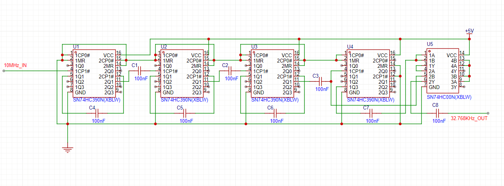
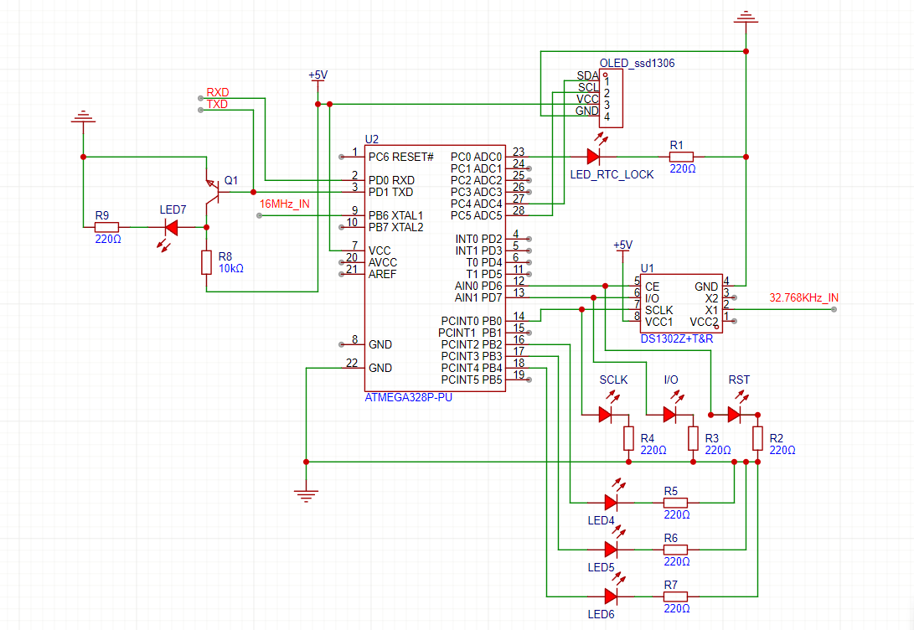

## 精确电子时钟

时钟不长期依赖于外部信息矫正，采用内部10MHZ震荡频率的TCXO作为稳定时钟震荡频率源，年老化率为0.1ppm，并经过由SN74HC390N ×4与SN74HC00N ×1组成的除法器将10MHZ分频为32.768KHZ以便于rtc(DS1302)使用，由rtc处理时钟信息后经由mcu(Arduino nano Atmega328p-pu)驱动rtc与显示屏并处理数据显示最终时间，年时钟误差＜15.8秒/年，初始时间可由串口传输，采用5v稳定直流电源输入。后期升级可考虑采用gps矫时模块做到年时钟误差长期＜1s，并包裹锡箔纸以屏蔽干扰做到除法器模块长期稳定运行(思路借鉴于一位好朋友，非常感谢其开源贡献)

